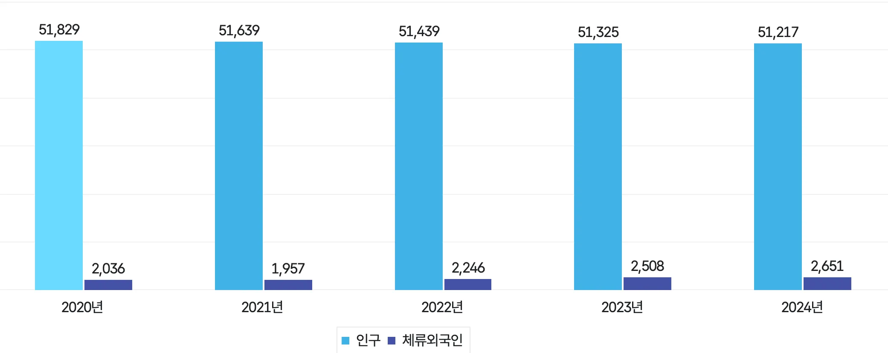
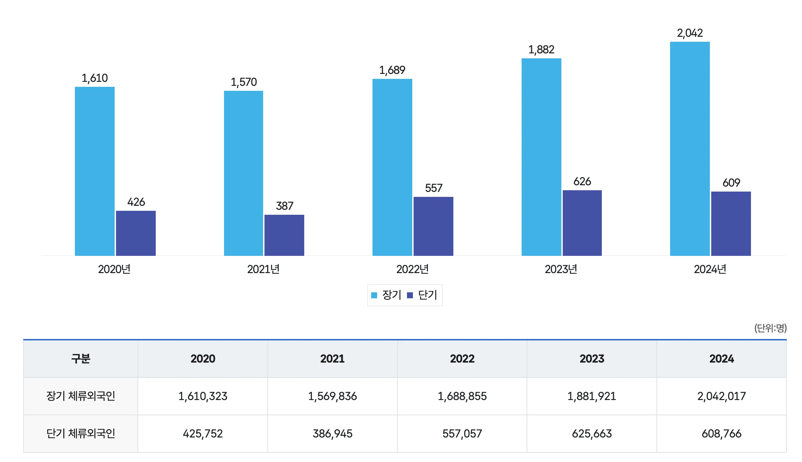
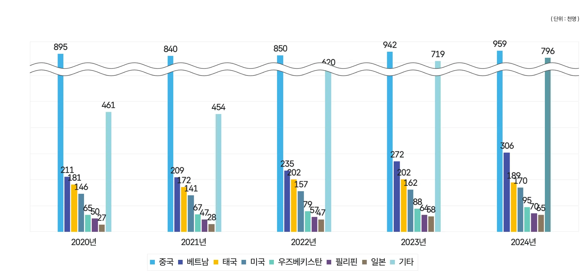
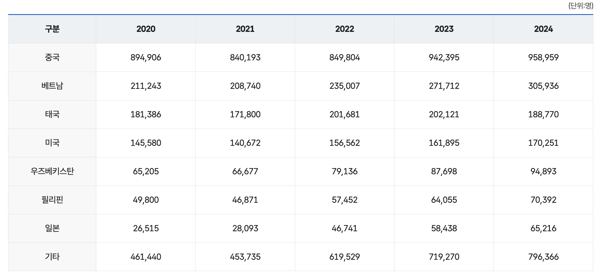

# 통계자료

매년 한국 인구는 다소 줄어들지만, 체류외국인 수는 늘어나고 있다.

체류외국인 중에서도 장기&단기 외국인으로 구분 된다.

장기&단기 역시 매년 증가하는 추세다.

주요 외국인 현황으로 **중국인** 인구가 가장 많고 두번째로 **기타** 세번째로 **베트남** 그 뒤로 **태국**, **미국** 등이 있다.

체류외국인들 중 중국, 베트남, 태국을 타겟으로 지정하고, 기타 나라는 사용자에게 질문을 통해 나라와 주 언어를 알아내도록 할것이다.

출처: 법무부([법령/자료>통계정보>출입국통계>체류외국인](https://www.moj.go.kr/moj/2412/subview.do))